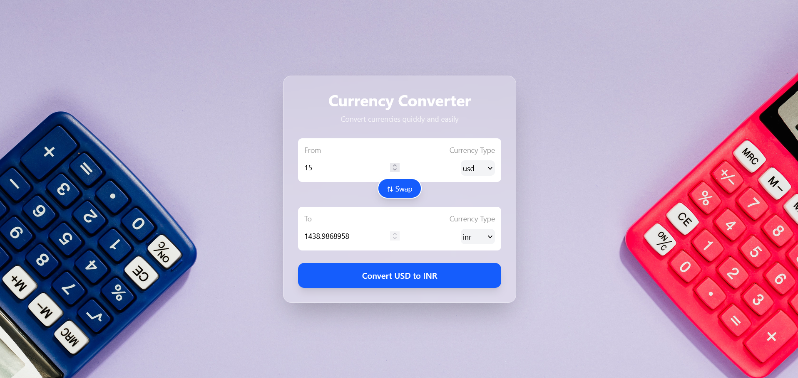

# 💱 Currency Converter

A modern and responsive **Currency Converter** built with **React.js** that allows users to convert amounts between different currencies using real-time exchange rate data.

## ✨ Features

- 🌍 Convert between multiple currencies
- 🔄 Swap source and target currencies easily
- ⚡ Real-time exchange rate data
- 🎨 Modern blue & pink themed UI
- 📱 Responsive design
- 🧩 Reusable React components
- 💰 Simple and easy-to-use interface

## 📸 Screenshots

### Currency Converter



The application provides a clean interface for selecting currencies, entering amounts, converting values, and swapping currencies.

## 🛠️ Tech Stack

- **React.js** – Frontend development
- **JavaScript** – Application logic
- **Tailwind CSS** – Styling and UI design
- **Vite** – Development environment
- **Currency API** – Real-time exchange rate data

## 🔧 How It Works

The application fetches exchange-rate data based on the selected source currency.

Users can:

1. Enter the amount they want to convert.
2. Select the source currency.
3. Select the target currency.
4. Click **Convert** to get the converted amount.
5. Use the **Swap** button to switch the currencies.

## 🚀 Run Locally

Clone the repository:

```bash
git clone https://github.com/your-username/Currency-Converter.git
